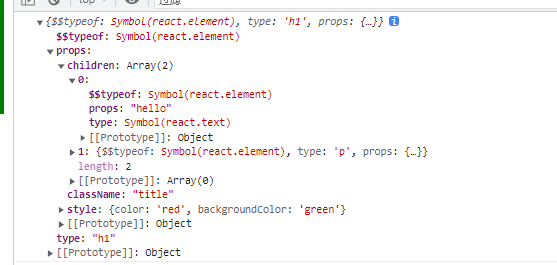

# 什么是JSX

是一种JS和HTML混合的语法，将组件的结构、数据、甚至样式都聚合在一起的写法

# 什么是虚拟DOM

> 待后续补充

# 核心实现代码

> JSX语法实际上是不能够直接在浏览器运行的，所以babel会在我们的工程编译阶段将我们的JSX语法转换成可执行的JS脚本（所以我们不需要纠结其为什么会突然调用到React关联库中的某些方法）。而在转换完成之后就会有两个关键方法——React库中的createReactElement以及React-DOM库中的render方法

* createReactElement
  
>这个方法主要是将JSX语法转换为虚拟dom的形式，大致就是以下这样,所以我们实现createReactElement方法时候就可以参考该结构
 
  


```
// constants.js
const REACT_TEXT = Symbol("react.text");

const REACT_ELEMENT = Symbol("react.element");

export { REACT_ELEMENT, REACT_TEXT };

// utils.js
import { REACT_TEXT, REACT_ELEMENT } from "./constants";

function toVdom(element) {
  return typeof element === "string" || typeof element === "number"
    ? { $$typeof: REACT_ELEMENT, type: REACT_TEXT, props: element }
    : element;
}

export { toVdom };

// react.js
import { REACT_ELEMENT } from "./constants";

import { toVdom } from "./utils";

/**
 * 创建一个元素，也就是所谓的虚拟DOM
 * @param {*} type
 * @param {*} config
 * @param {*} children
 * @returns
 */
function createElement(type, config, children) {
  if (config) {
    delete config.__self;
    delete config.__source;
  }
  let props = {
    ...config,
  };
  if (arguments.length > 3) {
    props.children = Array.prototype.slice.call(arguments, 2).map(toVdom);
  } else if (arguments.length === 3) {
    props.children = toVdom(children);
  }
  return {
    $$typeof: REACT_ELEMENT,
    type,
    props,
  };
}

const React = {
  createElement,
};

export default React;

```

> 以上代码都是基于babel转义后代码进行实现，不懂的可以在babel官网看下具体形式。这里的话主要针对的是两种子节点类型，一种是常规元素，一种是文本类型，所以转换为虚拟DOM时也只给到了两种类型，便于后续进行diff，最后生成我们想要的虚拟DOM结构形式。

* render

> 该方法主要是将我们构造的虚拟DOM结构转换成真实DOM并渲染到目标节点下

```
// constants.js
const REACT_TEXT = Symbol("react.text");

const REACT_ELEMENT = Symbol("react.element");

export { REACT_ELEMENT, REACT_TEXT };


// react-dom.js
import { REACT_TEXT } from "./constants";

/**
 * 把虚拟dom变成真实dom
 * 并且插入到父节点容器中
 * @param {*} vdom
 * @param {*} container
 */
function render(vdom, container) {
  let newDOM = createDOM(vdom);
  container.appendChild(newDOM);
}

/**
 * 创建真实节点
 * @param {*} vdom
 * @returns
 */
function createDOM(vdom) {
  let { type, props } = vdom;
  let dom = null;
  // 根据不同类型的虚拟dom， 创建真实dom
  if (type === REACT_TEXT) {
    dom = document.createTextNode(props);
  } else {
    dom = document.createElement(type);
  }
  if (props) {
    updateProps(dom, {}, props);
    if (
      props.children &&
      typeof props.children === "object" &&
      props.children.$$typeof
    ) {
      render(props.children, dom);
    } else if (props.children && Array.isArray(props.children)) {
      reconcileChildren(props.children, dom);
    }
  }
  return dom;
}

function reconcileChildren(childrenVdom, parentDom) {
  for (let i = 0; i < childrenVdom.length; i++) {
    render(childrenVdom[i], parentDom);
  }
}

/**
 * 把新属性同步到真实dom上
 * @param {*} dom 
 * @param {*} oldProps 
 * @param {*} newProps 
 */
function updateProps(dom, oldProps = {}, newProps = {}) {
  // 添加新属性
  for (const key in newProps) {
    if (key === "children") {
      continue;
    } else if (key === "style") {
      const styleObj = newProps[key];
      for (const attr in styleObj) {
        dom.style[attr] = styleObj[attr];
      }
    } else {
      dom[key] = newProps[key];
    }
  }
  //   删除老属性
  for (const key in oldProps) {
    if (!Object.hasOwnProperty.call(newProps, key)) {
      delete dom[key];
    }
  }
}

const ReactDOM = {
  render,
};

export default ReactDOM;

```

> 以上代码中，首先是对虚拟DOM类型进行判断，这边的话主要就是TEXT类型和常规元素类型，然后创建不同的真实DOM节点。其次就是更新节点的props属性，更新节点需要注意两点，一个是对于样式的处理，因为JSX语法中的style关联的是个对象，所以我们得对其进行遍历后挨个添加属性；另一个就是属性的删除，这个就不多赘述了，看代码就行。最后就是针对children属性进行递归处理，需要注意的是render方法递归调用时，父节点一定不能弄错。